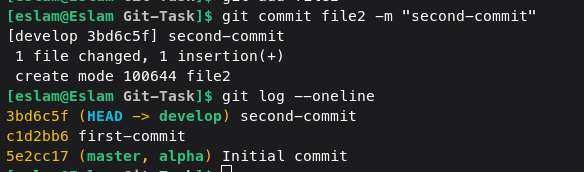
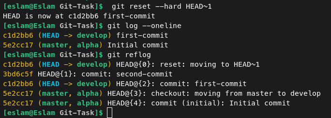
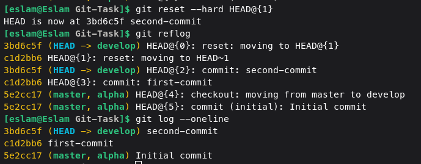
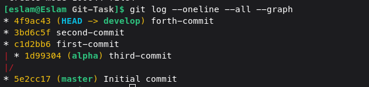
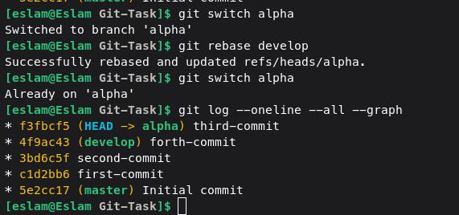

# GIT - TASK
- First i have initialized the repo using
- Created two branches alpha and develop
- Switched to develop branch
- Created file1 and file2 in develop branch
- Commited these files separately
  
  

- Went back to first commit with `git reset --hard HEAD~1`

  

- Used the same comand to go to commit 2

  

- Screenshot after commit 3 in alpha branch and commit 4 in develop branch
  
  

- Screenshot after merging develop into alpha

  

